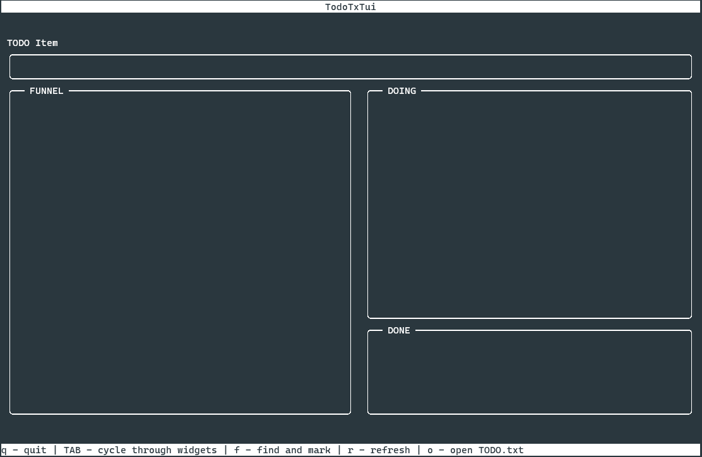

<!-- PROJECT LOGO -->
<p align="center">
    <a href=https://github.com/cigh033/todotxtui.git></a>
  <h3 align="center">TODOTXTUI - an intuitive TUI for TODO.txt files</h3>
</p>


<!-- TABLE OF CONTENTS -->
<details open="open">
  <summary><h2 style="display: inline-block">Table of Contents</h2></summary>
  <ol>
    <li>
      <a href="#getting-started">Getting Started</a>
    </li>
    <li><a href="#usage">Usage</a></li>
    <li><a href="#roadmap">Roadmap</a></li>
    <li><a href="#contributing">Contributing</a></li>
    <li><a href="#license">License</a></li>
    <li><a href="#contact">Contact</a></li>
    <li><a href="#acknowledgements">Acknowledgements</a></li>
  </ol>
</details>

<!-- GETTING STARTED -->
## Getting Started

To get a local copy up and running follow these simple steps.

### Installation

1. Clone the repo
   ```sh
   git clone https://github.com/cigh033/todotxtui.git
   ```
2. Install requirements
   ```sh
   pip -r requirments.txt
   ```
3. Run!
   ```sh
   python todotxtui.py
   ```   

<!-- USAGE EXAMPLES -->
## Usage

### config.json
* debug
  * (true|false) debug parameter (generates log file in running dir)
* unicode_borders
  * (true|false) If you want unicode rounded sexy corners or not
* todo_file_path
  * File Path for your Todo.txt file
* WIP_identifier
  * This is the Keyword which is applied when you put something in "DOING" (e.g. "@WIP")
* alternate_today
  * alternate keyword for today (maybe in your language)
* alternate_tomorrow
  * alternate keyword for tomorrow (maybe in your language)

### Modes
* OverView Mode
  * in overview mode you can cycle through widgets with arrows keys, and enter focus mode with enter.
    * you can also toggle some functions with following keys: 
      * q - quit application
      * TAB - cycle through widgets without using arrow keys and ENTER
      * f - find and mark | opens file dialog
      * r - refresh | refreshes the whole GUI
      * o - opens todo.txt in default system editor.
* Focus Mode
  * TODO Item Widget: Just hammer in your new TODO and press enter.
    * if you want a due date, than use due:2020-03-10 format. If you want to use due date today or tomorrow you can just type due:today or due:tomorrow (or the alternate keywords you set in config.json) it will be replaced with the according date.
  * FUNNEL in this widget is everything you are not currently working on.
    * ESC - for exiting the widget. ENTER on respective item moves it to "DOING"
  * DOING in this widget is everything you are working on at the moment
    * ESC - for exiting the widget. ENTER on respective item moves it to "DONE"
  * DONE in this widget is everything finished.
    * ESC - for exiting the widget. DEL for deleting items from the todo.txt list entirely

## Screenshots



<!-- ROADMAP -->
## Roadmap

nothing, really

<!-- CONTRIBUTING -->
## Contributing

Contributions are what make the open source community such an amazing place to be learn, inspire, and create. Any contributions you make are **greatly appreciated**.

<!-- LICENSE -->
## License

Distributed under the MIT License. See `LICENSE` for more information.

<!-- NOTE -->
## Note
Please note, that I don't know what the fuck I am doing. I just google stuff and use code snippets from StackOverflow. If you killed your todo.txt using this application, joke on you.
No Backup? No Mercy!

<!-- CONTACT -->
## Contact

[@cigh033](https://twitter.com/cigh033) - mail@cigh.de

Project Link: [https://github.com/cigh033/todotxtui](https://github.com/cigh033/todotxtui)

<!-- ACKNOWLEDGEMENTS -->
## Acknowledgements

* [jwoldek, creator of py_cui](https://github.com/jwlodek/py_cui)
* [telday, who's py_cui todotxt gave me the idea](https://gist.github.com/telday/227d39502d2fe017deb8b8b3c3b007f9)
* [SNicke Manarin, ScreenToGif (used for screenshots)](https://github.com/NickeManarin/ScreenToGif)
* [Plaintext Productivity provided by todotxt](http://todotxt.org/)
